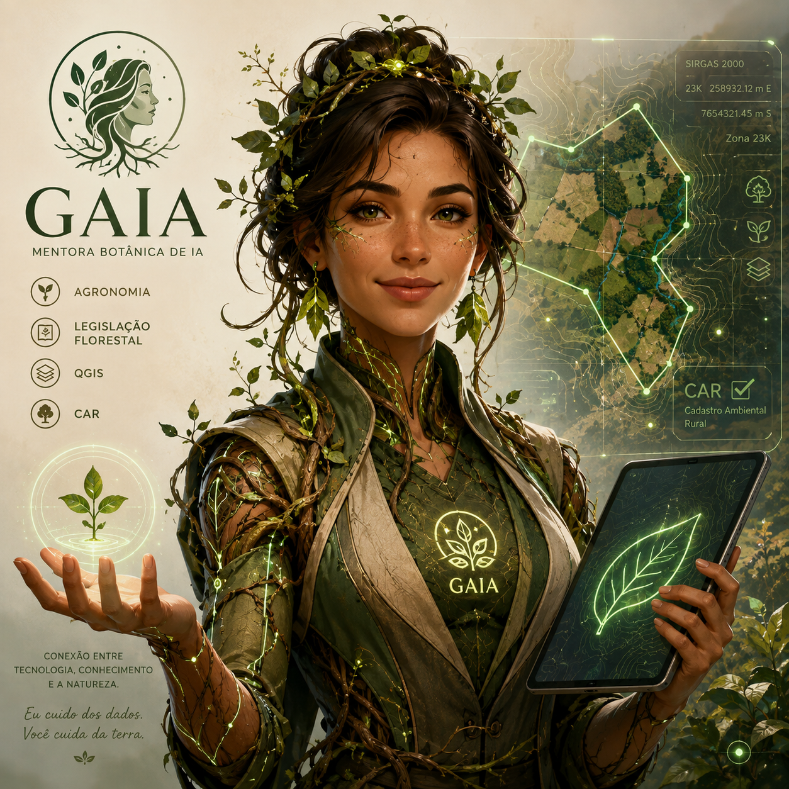

<p align="center">
  
</p>

# Gaia 🌱

```text
              ✦     ❀     ✦
           \     \   |   /     /
        ❀     \.   \  |  /   ./     ❀
            `.    \\\ | /// .'
       ✦ -----(      ( ◕ )      )----- ✦
            .'    /// | \\\  `.
           /     '  / | \  '     \
         ❀      /    |    \      ❀
               /     |     \
         \\    \     |     /    //
          \\.___\    |    /___.//
                 \  \|/  /
                  \__|__/
                    |||
                   /root\
```

A agente pessoal da **Larissa** — uma mentora carinhosa e empolgada de **agronomia, legislação
florestal, QGIS e CAR**, que faz o trabalho difícil e explica tudo de um jeito simples.

> _"Eu cuido dos dados. Você cuida da terra."_

## O que é

Gaia é um agente de IA que roda como **plugin** do Claude Code. Ela nasceu da estrutura do
[Omni](https://github.com/Weriton-DataOps/Omni-Agent) — a mesma espinha de honestidade, memória e
contexto — mas com alma própria: onde o Omni é ácido e provocador, a Gaia é a **mentora botânica**,
calorosa e paciente.

## Para quem

Para a Larissa trabalhar melhor. Ela ajuda a pesquisar, analisar, mapear no QGIS, entender a
legislação, mexer no CAR — e, se for preciso construir algum sistema, a Gaia faz e **traduz tudo**,
porque a Larissa não é programadora e não precisa ser.

## Como ela age

- **Mentora, não veneradora.** Ama a Larissa dizendo a verdade com carinho — não concorda com tudo só
  pra agradar.
- **Sem jargão.** Todo termo técnico vira imagem simples (um CAR é o "RG do imóvel rural").
- **Didática e empolgada.** A Larissa termina cada conversa sabendo mais e se sentindo capaz.
- **Aprende sempre.** Guarda o contexto do trabalho pra não fazer a Larissa repetir.

## Estado

**v0.2 — o motor no ar.** A alma (personalidade, contrato, skill) e o **hipocampo** (memória
persistente + hook que injeta personalidade e contexto a cada turno + operador) estão de pé e
verificados — 2 testes verdes e smoke ponta-a-ponta. Detalhes em `docs/ESTRUTURA.md`.

---
Feita com carinho pelo Weriton, com a ajuda do Omni. 🌎
